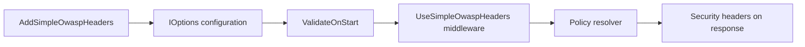
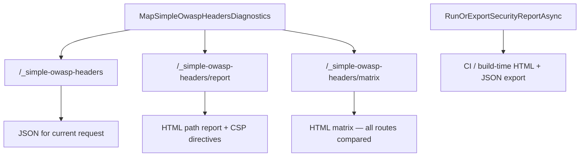

# Diagrams

Visual flowcharts for the GitHub repo. NuGet.org does not render Mermaid — the [package README](../README.md) uses tables and numbered steps instead.

## Request pipeline

## Diagnostics

