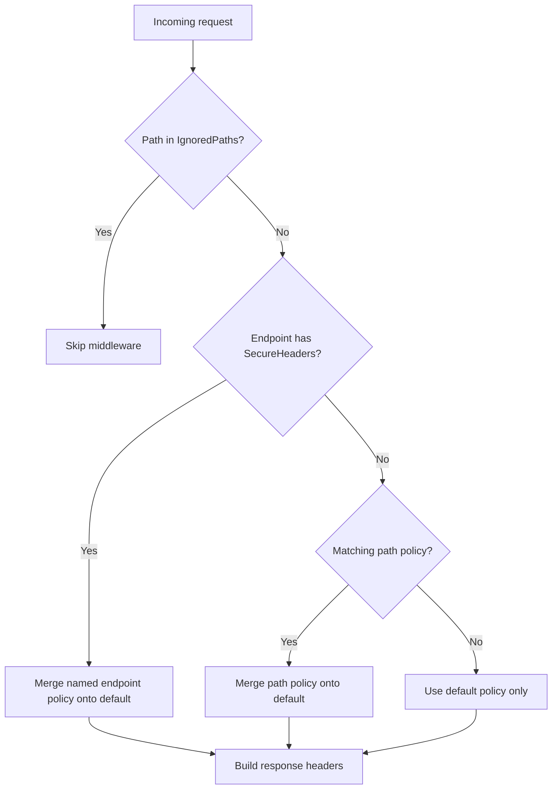

# Policy merge rules

SimpleOwaspHeaders resolves the effective policy in this order (highest priority first):

1. **Endpoint metadata** — `[SecureHeaders("PolicyName")]` on a controller action or minimal API route
2. **Path policies** — longest matching prefix or first matching regex (see below)
3. **Default policy** — `DefaultPolicy` or `DefaultPreset` from configuration

## Merge semantics

When a higher-priority policy is found, it is **merged** onto the default policy:

- **CSP directives** — merged individually; only directives configured in the override replace the base
- **Other reference-type properties** (HSTS, CORP, etc.) — override replaces base when non-null
- **Boolean flags** (`XContentTypeOptions`, `XXssProtectionDisabled`, CSP flags) — OR-combined

Example: default OWASP CSP + `/admin` override with only `ScriptSources("'none'")` replaces `script-src` but keeps `object-src`, `block-all-mixed-content`, and other default directives.

## Path matching

| `MatchKind` | Behaviour |
|-------------|-----------|
| `Prefix`    | `requestPath.StartsWith(pattern)` — longest prefix wins |
| `Regex`     | .NET regex match — first registered match after sort by priority |

Named path policies reference `NamedPolicies` instead of inline `Policy` objects.

## Per-request headers

- **CSP nonces** — resolved per request when `WithNonce()` is configured
- **Clear-Site-Data** — path-specific directives resolved per request from `ClearSiteDataPathOptions`

## Ignored paths

Exact path matches in `IgnoredPaths` skip the middleware entirely (no headers applied).
